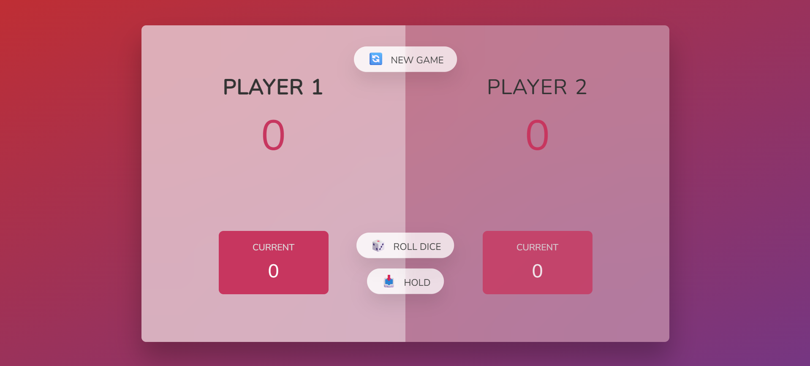

<p align = "center">
<br>

<br>
<br>
</p>

<h2 align = "center">🐷 JAVASCRIPT PIG-GAME</h2>

<p align = "center">
<a href = "https://javscript-pig-game-v3.netlify.app">Javascript Pig-Game</a> is a <strong> Fun two player</strong> dice-game built <em>with Html, CSS and Javascript</em>
<br>
<br>
<a href = "#">

</a>
&nbsp;
<a href = "#">

</a>
&nbsp;
<a href = "#">

</a>
</p>

# Description

The <strong> Pig Game</strong> is a simple 2-player dice game built with <em> HTML, CSS, and JavaScript </em>. It's a fun turn-based game where players roll a die and try to reach a score of <strong> <u> 100</u></strong> before the other player.

### <p align = "center"><u>🎯 Objective </u></p>

<p align = "center"><strong>
Be the first player to reach 100 points.
</strong>
</p>
<br>

## 🧠 How It Works

- Each player takes turns.
- On their turn, ,<strong> they can roll the die:</strong>
  - If the result is between the range of <strong>2–6</strong>, the number is <strong> added to their current score.</strong>
  - If the result is <strong> 1</strong>, they lose their current score, and it becomes the <strong> next player’s turn </strong>.
- At any point during their turn, a player can <strong> “Hold” </strong>:
  - This will <strong> save their current score </strong> to their total score, and then it becomes the other player's turn.
- First player to reach or pass <strong> 100 total points </strong>wins.

## 🎮 Controls

- <strong> Roll Dice Button:</strong> Rolls the dice.
- <strong>Hold Button:</strong> Saves current score and switches turn.
- <strong> New Game Button:</strong> Resets the game for both players.

## 🛠️ Built With

- <strong>HTML:</strong> Structure of the game.
- <strong>CSS:</strong> Styling and layout.
- <strong>JavaScript:</strong> Game logic and interactivity.

## 💥Features

- Dice roll animation
- Hold and New Game functionality
- Switches players automatically
- Simple, clean UI

## 🚀 Technologies Used

- HTML
- CSS
- JavaScript (Vanilla)

## 📸 Screenshot



## 🧩 How to Play

1. Clone this Repo

```
git clone https://github.com/mindfullMellow/Pig--game-with-javascript
```

2.Open <strong> index.html</strong> in any browser.
<br>

## 🔗 Live Demo

<a href ="https://javscript-pig-game-v3.netlify.app">Click to Play </a>

## 🙌 Author

<a href="https://github.com/mindfullMellow">Samuel Daniel Emeka</a>

GitHub: @mindfullMellow

## 📄 License

This project is licensed under the MIT License - see the [LICENSE](LICENSE) file for details.
